# Diagrama de Casos de Uso - PyLearn CESMAG

```mermaid
graph TB
    %% Actores
    Student[👨‍🎓 Estudiante]
    Teacher[👨‍🏫 Profesor]
    Admin[👨‍💼 Administrador]
    
    %% Sistema
    subgraph PyLearn["🐍 Sistema PyLearn"]
        %% Casos de uso de Autenticación
        subgraph Auth["🔐 Autenticación"]
            Login[Iniciar Sesión]
            Register[Registrarse]
            Logout[Cerrar Sesión]
        end
        
        %% Casos de uso de Aprendizaje
        subgraph Learning["📚 Aprendizaje"]
            ViewModules[Ver Módulos]
            StudyLesson[Estudiar Lección]
            TakeChallenge[Realizar Desafío]
            ViewProgress[Ver Progreso]
            GeneratePlan[Generar Plan de Estudio]
        end
        
        %% Casos de uso del Foro
        subgraph Forum["💬 Foro"]
            ViewQuestions[Ver Preguntas]
            AskQuestion[Hacer Pregunta]
            AnswerQuestion[Responder Pregunta]
            VotePost[Votar Publicación]
            CloseQuestion[Cerrar Pregunta]
        end
        
        %% Casos de uso de Gamificación
        subgraph Gamification["🎮 Gamificación"]
            ViewLeaderboard[Ver Tabla de Posiciones]
            EarnPoints[Ganar Puntos]
            UnlockAchievements[Desbloquear Logros]
            ViewBadges[Ver Insignias]
        end
        
        %% Casos de uso de Perfil
        subgraph Profile["👤 Perfil"]
            ViewProfile[Ver Perfil]
            EditProfile[Editar Perfil]
            UploadAvatar[Subir Avatar]
            ViewNotifications[Ver Notificaciones]
            CustomizeTheme[Personalizar Tema]
        end
        
        %% Casos de uso de Tienda
        subgraph Store["🛒 Tienda"]
            ViewStore[Ver Tienda]
            BuyItems[Comprar Artículos]
            ViewPurchases[Ver Compras]
        end
        
        %% Casos de uso del Profesor
        subgraph TeacherPanel["👨‍🏫 Panel Profesor"]
            ViewStudents[Ver Estudiantes]
            CreateContent[Crear Contenido]
            ReviewProgress[Revisar Progreso]
            ManageAssignments[Gestionar Tareas]
        end
        
        %% Casos de uso del Administrador
        subgraph AdminPanel["⚙️ Panel Admin"]
            ManageUsers[Gestionar Usuarios]
            ViewAnalytics[Ver Analíticas]
            SystemConfig[Configurar Sistema]
            ManageContent[Gestionar Contenido]
        end
    end
    
    %% Relaciones Estudiante
    Student --> Login
    Student --> Register
    Student --> Logout
    Student --> ViewModules
    Student --> StudyLesson
    Student --> TakeChallenge
    Student --> ViewProgress
    Student --> GeneratePlan
    Student --> ViewQuestions
    Student --> AskQuestion
    Student --> AnswerQuestion
    Student --> VotePost
    Student --> ViewLeaderboard
    Student --> EarnPoints
    Student --> UnlockAchievements
    Student --> ViewBadges
    Student --> ViewProfile
    Student --> EditProfile
    Student --> UploadAvatar
    Student --> ViewNotifications
    Student --> CustomizeTheme
    Student --> ViewStore
    Student --> BuyItems
    Student --> ViewPurchases
    
    %% Relaciones Profesor
    Teacher --> Login
    Teacher --> Logout
    Teacher --> ViewStudents
    Teacher --> CreateContent
    Teacher --> ReviewProgress
    Teacher --> ManageAssignments
    Teacher --> ViewQuestions
    Teacher --> AnswerQuestion
    Teacher --> CloseQuestion
    Teacher --> ViewProfile
    Teacher --> EditProfile
    Teacher --> UploadAvatar
    Teacher --> ViewNotifications
    
    %% Relaciones Administrador
    Admin --> Login
    Admin --> Logout
    Admin --> ManageUsers
    Admin --> ViewAnalytics
    Admin --> SystemConfig
    Admin --> ManageContent
    Admin --> ViewProfile
    Admin --> EditProfile
    
    %% Estilos
    classDef actor fill:#e1f5fe,stroke:#01579b,stroke-width:2px
    classDef usecase fill:#f3e5f5,stroke:#4a148c,stroke-width:1px
    classDef system fill:#e8f5e8,stroke:#2e7d32,stroke-width:2px
    
    class Student,Teacher,Admin actor
    class PyLearn system
```

## Descripción de Actores

### 👨‍🎓 Estudiante
- **Rol principal:** Aprender Python de forma gamificada
- **Permisos:** Acceso a módulos, desafíos, foro, tienda y gamificación

### 👨‍🏫 Profesor  
- **Rol:** Supervisar y guiar el aprendizaje de estudiantes
- **Permisos:** Gestión de contenido, revisión de progreso, moderación del foro

### 👨‍💼 Administrador
- **Rol:** Gestión completa del sistema
- **Permisos:** Configuración del sistema, gestión de usuarios, analíticas

## Casos de Uso Principales

### 🔐 Autenticación
- Registro e inicio de sesión seguro
- Gestión de sesiones de usuario

### 📚 Aprendizaje
- Sistema modular de lecciones
- Desafíos de programación interactivos
- Seguimiento de progreso personalizado

### 💬 Foro Académico
- Preguntas y respuestas entre estudiantes
- Sistema de votación y moderación
- Gamificación por participación

### 🎮 Gamificación
- Sistema de puntos y logros
- Tabla de posiciones competitiva
- Insignias por hitos alcanzados

### 🛒 Tienda Virtual
- Compra de elementos con puntos ganados
- Personalización de perfil y avatar